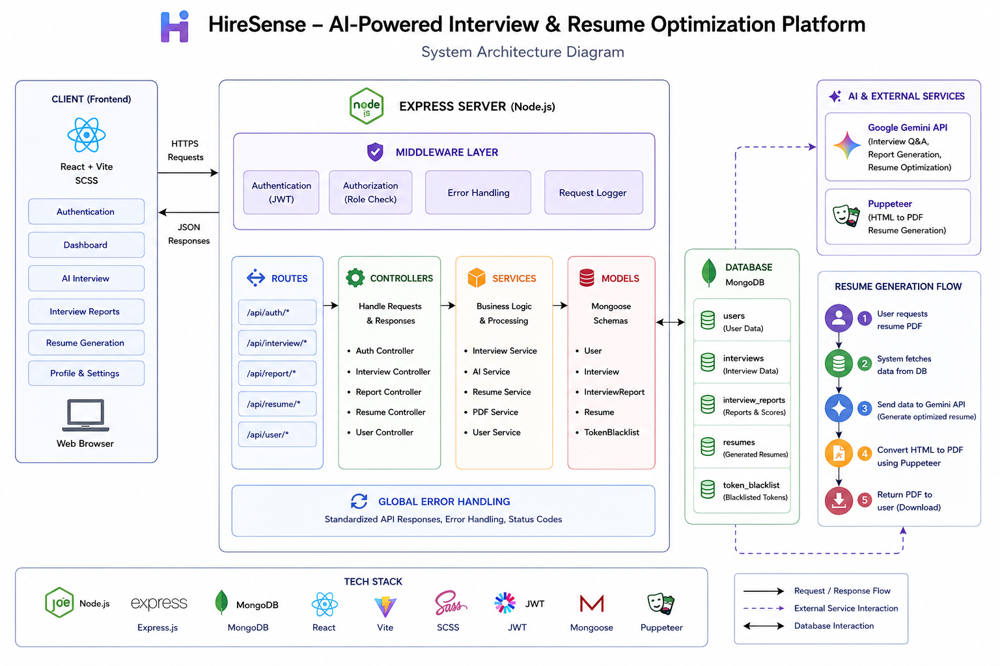

# HireSense

HireSense is an AI-powered interview preparation platform that helps candidates optimize their job applications. It analyzes resumes, self-descriptions, and job descriptions to generate personalized interview reports, including technical and behavioral questions, skill gap analysis, and preparation plans. Additionally, it can generate tailored resume PDFs optimized for specific job roles.

## System Architecture



## Features

- **Interview Report Generation**: Upload your resume and provide self-description and job description to get a comprehensive interview report.
- **AI-Powered Analysis**: Uses Google Gemini AI to generate tailored questions, skill assessments, and preparation strategies.
- **Resume Optimization**: Generate ATS-friendly resume PDFs customized for target job positions.
- **User Authentication**: Secure JWT-based authentication for user accounts.
- **Responsive UI**: Modern React-based frontend with intuitive user interface.
- **PDF Processing**: Supports PDF resume uploads and generates downloadable PDF reports.

## Tech Stack

### Backend
- **Node.js** with **Express.js** for server-side logic
- **MongoDB** with **Mongoose** for data storage
- **JWT** for authentication
- **Google GenAI (Gemini)** for AI-powered content generation
- **Puppeteer** for PDF generation from HTML
- **pdf-parse** for extracting text from PDF resumes
- **Multer** for file uploads

### Frontend
- **React** with **Vite** for fast development and building
- **React Router** for client-side routing
- **SCSS** for styling
- **Axios** for API calls

## Prerequisites

Before running this project, ensure you have the following installed:

- **Node.js** (version 16 or higher)
- **npm** or **yarn**
- **MongoDB** (local or cloud instance)
- **Google Cloud API Key** for Gemini AI

## Installation

1. **Clone the repository:**
   ```bash
   git clone <repository-url>
   cd HireSense
   ```

2. **Backend Setup:**
   ```bash
   cd Backend
   npm install
   ```

   - Create a `.env` file in the `Backend` directory with the following variables:
     ```
     PORT=5000
     MONGODB_URI=mongodb://localhost:27017/hiresense
     JWT_SECRET=your_jwt_secret_key
     GOOGLE_GENAI_API_KEY=your_google_genai_api_key
     ```

3. **Frontend Setup:**
   ```bash
   cd ../Frontend
   npm install
   ```

4. **Database Setup:**
   - Ensure MongoDB is running on your system.
   - The application will automatically create the necessary collections.

## Usage

1. **Start the Backend:**
   ```bash
   cd Backend
   npm run dev
   ```
   The backend server will start on `http://localhost:5000`.

2. **Start the Frontend:**
   ```bash
   cd Frontend
   npm run dev
   ```
   The frontend will be available at `http://localhost:5173` (default Vite port).

3. **Access the Application:**
   - Open your browser and navigate to the frontend URL.
   - Register a new account or log in.
   - Upload your resume (PDF), enter self-description and job description.
   - Generate interview reports and optimized resumes.

## API Endpoints

### Authentication
- `POST /api/auth/register` - User registration
- `POST /api/auth/login` - User login

### Interview Reports
- `POST /api/interview/generate` - Generate interview report
- `GET /api/interview/:id` - Get interview report by ID
- `GET /api/interview/all` - Get all user interview reports
- `POST /api/interview/resume/pdf/:id` - Generate and download resume PDF

## Project Structure

```
HireSense/
├── Backend/
│   ├── src/
│   │   ├── controllers/
│   │   ├── middleware/
│   │   ├── models/
│   │   ├── routes/
│   │   ├── services/
│   │   └── app.js
│   ├── package.json
│   └── server.js
├── Frontend/
│   ├── src/
│   │   ├── features/
│   │   │   ├── auth/
│   │   │   └── interview/
│   │   ├── App.jsx
│   │   └── main.jsx
│   ├── package.json
│   └── vite.config.js
└── README.md
```

## Contributing

1. Fork the repository.
2. Create a feature branch: `git checkout -b feature-name`.
3. Commit your changes: `git commit -m 'Add some feature'`.
4. Push to the branch: `git push origin feature-name`.
5. Open a pull request.

## License

This project is licensed under the ISC License.

## 👨‍💻 Author

**Sahil Rathore**

- 🔗 GitHub: https://github.com/SAHILRATHORE
- 🔗 LinkedIn: https://www.linkedin.com/in/sahil-rathore-641119245/
- 🔗 Instagram: https://www.instagram.com/saahhhhiiiiiiiillllllllll/

## 🙌 Acknowledgements

This project was built as part of learning and implementing real-world banking transaction workflows including authentication, ledger systems, and secure API design.


⭐ If you find this project useful, consider giving it a star on GitHub!

## Support

If you encounter any issues or have questions, please open an issue on the GitHub repository or ask on LinkedIn.